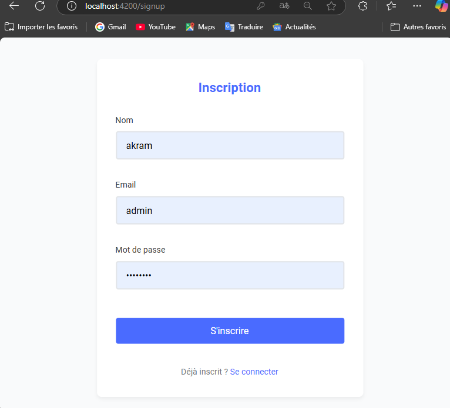

# Système d'Authentification - TP 5

Ce projet implémente un système d'authentification complet avec les fonctionnalités d'inscription (Signup), connexion (Login) et déconnexion (Logout) en utilisant deux frameworks front-end populaires : Angular et React.js.

## Table des matières

- [Description du projet](#description-du-projet)
- [Fonctionnalités](#fonctionnalités)
- [Technologies utilisées](#technologies-utilisées)
- [Installation et configuration](#installation-et-configuration)
  - [Version Angular](#version-angular)
  - [Version React](#version-react)
  - [Configuration de JSON Server](#configuration-de-json-server)
- [Structure du projet](#structure-du-projet)
  - [Structure Angular](#structure-angular)
  - [Structure React](#structure-react)
- [Captures d'écran](#captures-décran)
- [Comparaison des implémentations](#comparaison-des-implémentations)
- [Bonnes pratiques appliquées](#bonnes-pratiques-appliquées)

## Description du projet

L'objectif de ce TP est de développer une application web permettant la gestion de l'authentification des utilisateurs en utilisant à la fois Angular et React.js. Le backend est simulé à l'aide de JSON Server, qui fournit une API REST pour stocker les informations des utilisateurs.

## Fonctionnalités

- **Inscription (Signup)** : Permet à un nouvel utilisateur de créer un compte
- **Connexion (Login)** : Authentifie un utilisateur existant
- **Déconnexion (Logout)** : Permet à l'utilisateur de se déconnecter de l'application
- **Protection des routes** : Empêche l'accès aux pages protégées sans authentification
- **Redirection** : Redirige l'utilisateur vers la page de connexion s'il tente d'accéder à une page protégée sans être authentifié

## Technologies utilisées

- **Frontend** :
  - Angular (version 17+)
  - React.js (version 18+)
  - HTML/CSS
  - Bootstrap ou Material Design (UI frameworks)
- **Backend simulé** :
  - JSON Server

## Installation et configuration

### Version Angular

1. **Prérequis**
   - Node.js (v14+)
   - npm ou yarn
   - Angular CLI (`npm install -g @angular/cli`)

2. **Installation**
   ```bash
   # Cloner le dépôt
   git clone [url-du-repo]
   
   # Accéder au dossier angular
   cd auth-system/angular
   
   # Installer les dépendances
   npm install
   
   # Démarrer l'application
   ng serve
   ```

3. **Accès à l'application**
   - Ouvrir un navigateur et accéder à `http://localhost:4200`

### Version React

1. **Prérequis**
   - Node.js (v14+)
   - npm ou yarn

2. **Installation**
   ```bash
   # Accéder au dossier react
   cd auth-system/react
   
   # Installer les dépendances
   npm install
   
   # Démarrer l'application
   npm start
   ```

3. **Accès à l'application**
   - Ouvrir un navigateur et accéder à `http://localhost:3000`

### Configuration de JSON Server

1. **Installation de JSON Server**
   ```bash
   npm install -g json-server
   ```

2. **Création du fichier de données**
   - Créer un fichier `db.json` à la racine du projet avec la structure suivante :
   ```json
   {
     "users": []
   }
   ```

3. **Démarrage du serveur**
   ```bash
   json-server --watch db.json --port 3001
   ```

## Structure du projet

### Structure Angular

```
angular/
├── src/
│   ├── app/
│   │   ├── components/
│   │   │   ├── login/
│   │   │   ├── signup/
│   │   │   ├── dashboard/
│   │   │   └── heaser/
│   │   ├── auth-guard.service.ts
│   │   │── auth.service.ts
│   │   │   
│   │   ├
│   │   │  
│   │   ├── app-routing.module.ts
│   │   ├
│   │   └── app.component.ts
│   ├── assets/
│   └── index.html
```

### Structure React

```
react/
├── src/
│   ├── components/
│   │   ├── Login.js
│   │   ├── Signup.js
│   │   ├── Home.js
│   │   └── Navbar.js   
|   |   |── ProtectedRoute.js
│   ├── contexts/
│   │   └── AuthContext.js
│   ├── services/
│   │   └── authService.js
│   ├
│   ├── App.js
│   └── index.js
```

## Captures d'écran

### Version Angular

#### Page de connexion (Angular)


#### Page d'inscription (Angular)


#### Page d'accueil après authentification (Angular)


### Version React

#### Page de connexion (React)

#### Page d'inscription (React)


#### Page d'accueil après authentification (React)


## Comparaison des implémentations

### Gestion de l'état

- **Angular** : Utilise les services et l'injection de dépendances pour gérer l'état d'authentification
- **React** : Utilise le Context API et les hooks (useState, useEffect) pour gérer l'état d'authentification

### Protection des routes

- **Angular** : Utilise les Guards (CanActivate) pour protéger les routes
- **React** : Utilise des composants HOC (Higher Order Components) ou des composants de protection personnalisés

### Stockage des tokens

- **Angular** : Utilise localStorage ou les services pour stocker et gérer les tokens JWT
- **React** : Utilise localStorage et le Context API pour partager l'état d'authentification

## Bonnes pratiques appliquées

- **Séparation des responsabilités** : Composants, services et modèles clairement séparés
- **Gestion sécurisée des tokens** : Stockage approprié des tokens JWT
- **Code modulaire** : Organisation claire des fichiers et des fonctionnalités
- **Validation des formulaires** : Contrôles de validation pour les formulaires d'inscription et de connexion
- **Gestion des erreurs** : Affichage approprié des messages d'erreur
- **Protection des routes** : Implémentation robuste de la protection des routes
- **UI responsive** : Interface utilisateur adaptée à différentes tailles d'écran